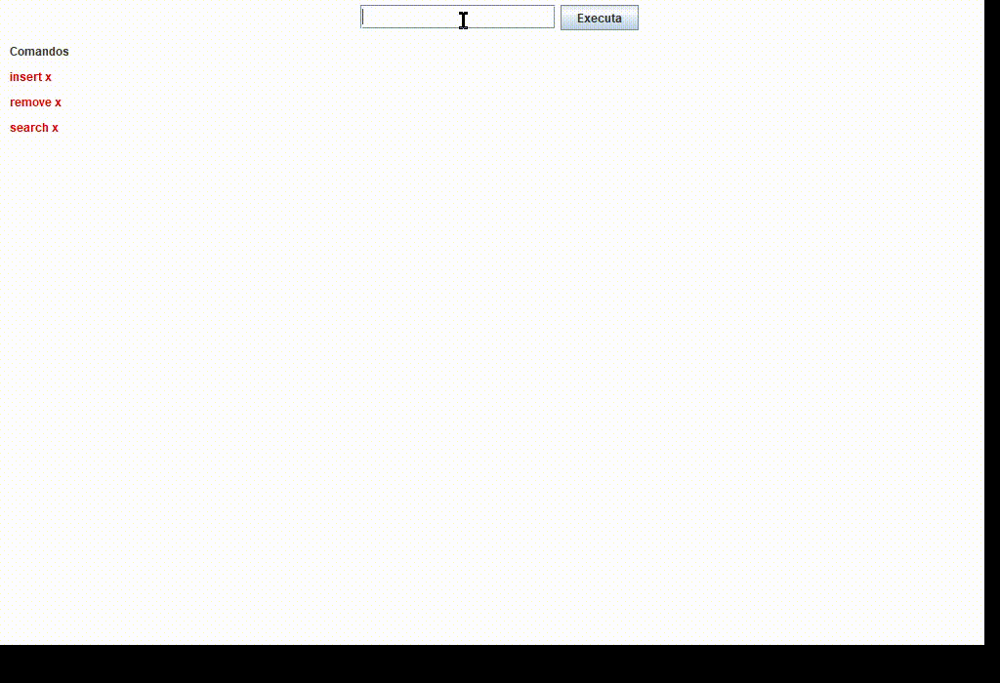
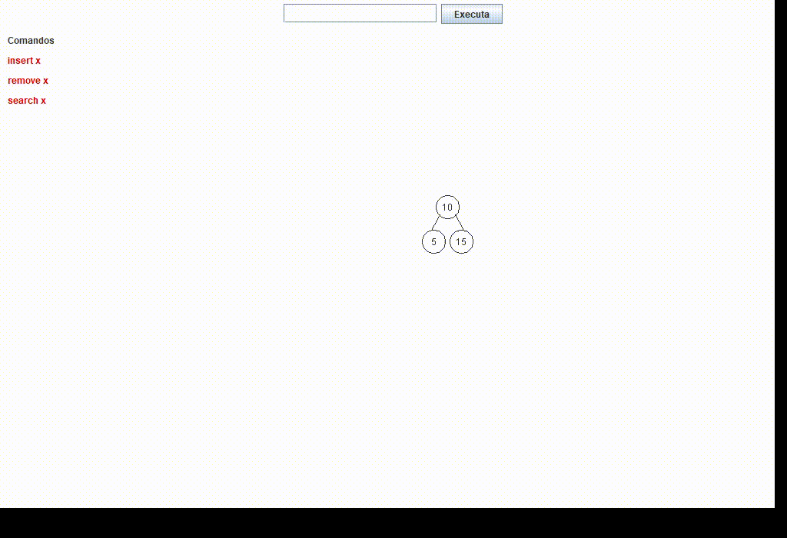
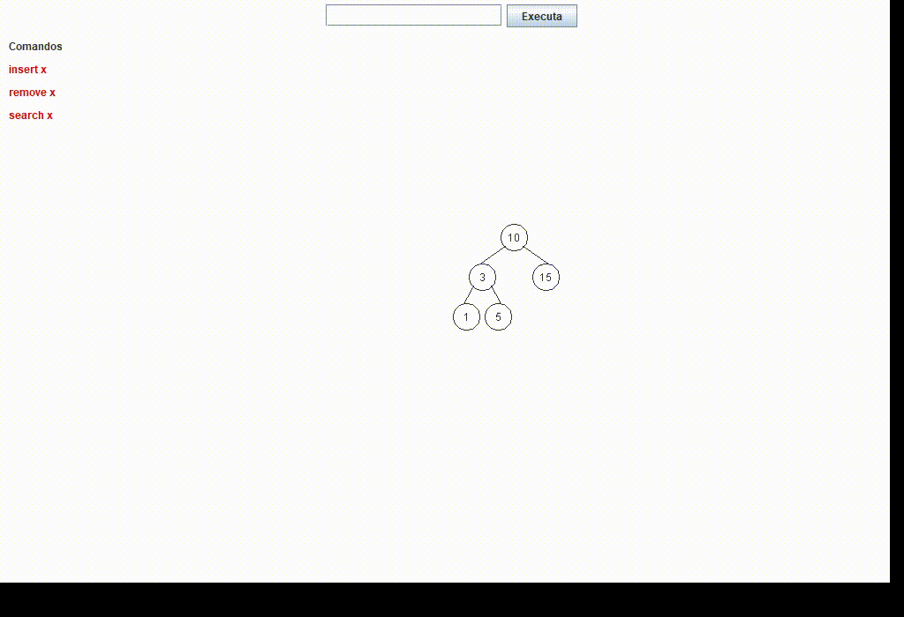

<p align="left">
  
  
  
  <!--  -->
</p>

# AVL Tree Implementation with Java Swing GUI

This project is an academic implementation of an **AVL Tree (Adelson-Velsky and Landis)**, a self-balancing binary search tree (BST). The program is developed in Java and utilizes the **Swing library (JFrame)** to provide an interactive graphical user interface (GUI).

This repository demonstrates skills in Java, advanced data structures, and GUI development, applying concepts learned in the **"Algorithms and Programming: Trees and Sorting"** university course.

|            Node Insertion            |         Balancing (Rotation)          |            Node Deletion            |
| :----------------------------------: | :-----------------------------------: | :---------------------------------: |
|  |  |  |

---

## 🚀 About the Project

This project was developed as a core assignment for the **"Algorithms and Programming"** course. The primary goal was to implement a functional AVL Tree capable of performing fundamental operations and handling self-balancing logic based on specific assignment criteria.

### Technical Requirements

The application strictly adheres to the following specifications:

- **Core Operations:** Full implementation of **insertion**, **deletion**, and **search**.
- **Keys:** The tree operates exclusively with **integer** keys.
- **Node Structure:** Each node stores only essential data: the key, the **balance factor**, and **pointers** to left/right subtrees.
- **Data Input:** Operations are supported via keyboard input (console) or the GUI.
- **Rotation Feedback:** For every balancing operation (triggered by insertion or deletion), the console provides a detailed log of the **rotation performed** (Single/Double, Left/Right) and the key that caused the imbalance.
- **Visualization:** The state of the tree is visually rendered using **Java Swing (JFrame)**, allowing for real-time observation of tree structure changes.

---

## ✨ Features

Beyond the core requirements, this implementation includes:

- **Interactive GUI:** A user-friendly interface allows users to easily insert, remove, and search for values using buttons and input fields.
- **Real-Time Visualization:** The tree is redrawn immediately after every operation, providing visual feedback on how the structure adapts and balances.
- **Console Reporting:** The console remains active to display detailed rotation logs, serving as a valuable tool for debugging and learning the mechanics of AVL trees.

---

## 🛠️ Technologies Used

- **Java:** The core language for the project logic.
- **Java Swing (JFrame):** Used to build the graphical user interface and render the tree structure.

---

## 🏃 How to Run

1.  Clone this repository:
    ```bash
    git clone [https://github.com/RobsonMobarack/Structura](https://github.com/RobsonMobarack/Structura)
    ```
2.  Open the project in your preferred Java IDE (e.g., Eclipse, IntelliJ IDEA, or NetBeans). Or, if you have Maven and the environment variables correctly configured, use:
    ```bash
    mvn install exec:java
    ```
3.  Locate the main class responsible for initializing the `JFrame`.
4.  Run the file.
5.  Use the interface buttons and text fields to interact with the tree.

---

## 👨‍💻 Author

**Robson Mobarack**

- **LinkedIn:** [Robson Mobarack](https://linkedin.com/in/robson-mobarack)
- **GitHub:** [Structura](https://github.com/RobsonMobarack/Structura)
